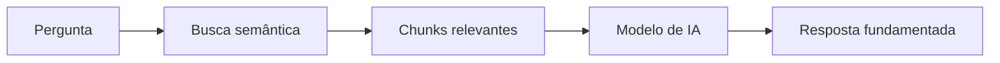

## What is RAG?

RAG (Retrieval-Augmented Generation) is a technique that combines **semantic search** with **AI text generation**. Instead of the model making up answers, it consults your real knowledge base and generates grounded answers.

---

## How It Works in Tartini

### 1. Knowledge Base
Your documents, FAQs, and website content are processed and stored in a **vector database** (embeddings). Each piece of content becomes a "chunk" with metadata.

### 2. Semantic Search
When you send a query, the system converts the text into a vector and searches for the most similar chunks, even if they use different words.

> "How do I return a product?" finds content about "return policy" even without using the same words.

### 3. Answer Generation (optional)
If you use `returnMode: "ai_generated_answer"`, an AI model generates a natural answer using the chunks found as its basis.

---

## Key Concepts

### Source Types

| Type | Description |
|------|-----------|
| `document` | Uploaded documents (PDF, DOCX, etc.) |
| `qa` | Registered question-and-answer pairs |
| `website` | Content extracted from websites via crawling |

### Audience

| Audience | Use |
|----------|-----|
| `ai_agent` | AI agents that serve customers directly |
| `copilot` | Assistants that help human agents |
| `strategist` | Strategic analysis and insights |

### Score Threshold

The `scoreThreshold` (0 to 1) defines the minimum relevance level:

- **0.5 - 0.6**: More results, lower precision
- **0.7 - 0.8**: Balance between quantity and quality (recommended)
- **0.9+**: Only highly relevant results

### Reranking

When `useRerank: true`, results go through a second model that reorders them by actual relevance.

---

## Return Modes

### `chunks_only`
Returns only the raw chunks. Useful when you want to process the results in your own system.

### `ai_generated_answer`
Returns the chunks **and** an AI-generated answer.

<Note>
  The `ai_generated_answer` mode is slower because it includes the generation step. Use `chunks_only` when latency is critical.
</Note>
