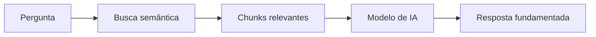

## ¿Qué es RAG?

RAG (Retrieval-Augmented Generation) es una técnica que combina **búsqueda semántica** con **generación de texto por IA**. En vez de que el modelo invente respuestas, consulta tu base de conocimiento real y genera respuestas fundamentadas.

---

## Cómo funciona en Tartini

### 1. Base de conocimiento
Tus documentos, FAQs y contenido de sitios se procesan y almacenan en una **base de datos vectorial** (embeddings). Cada fragmento de contenido se convierte en un "chunk" con metadatos.

### 2. Búsqueda semántica
Cuando envías una consulta, el sistema convierte el texto en un vector y busca los chunks más similares, incluso si usan palabras diferentes.

> "¿Cómo devolver un producto?" encuentra contenido sobre "política de devolución" incluso sin usar las mismas palabras.

### 3. Generación de respuesta (opcional)
Si usas `returnMode: "ai_generated_answer"`, un modelo de IA genera una respuesta natural usando los chunks encontrados como base.

---

## Conceptos clave

### Source Types

| Tipo | Descripción |
|------|-----------|
| `document` | Documentos cargados (PDF, DOCX, etc.) |
| `qa` | Pares de pregunta y respuesta registrados |
| `website` | Contenido extraído de sitios vía crawling |

### Audience

| Audience | Uso |
|----------|-----|
| `ai_agent` | Agentes de IA que atienden clientes directamente |
| `sotto` | Asistentes que ayudan a agentes humanos |
| `strategist` | Análisis estratégico e insights |

### Score Threshold

El `scoreThreshold` (0 a 1) define el nivel mínimo de relevancia:

- **0.5 - 0.6**: Más resultados, menor precisión
- **0.7 - 0.8**: Equilibrio entre cantidad y calidad (recomendado)
- **0.9+**: Solo resultados altamente relevantes

### Reranking

Cuando `useRerank: true`, los resultados pasan por un segundo modelo que los reordena por relevancia real.

---

## Modos de retorno

### `chunks_only`
Devuelve solo los chunks en bruto. Útil cuando quieres procesar los resultados en tu propio sistema.

### `ai_generated_answer`
Devuelve los chunks **y** una respuesta generada por IA.

<Note>
  El modo `ai_generated_answer` es más lento porque incluye la etapa de generación. Usa `chunks_only` cuando la latencia sea crítica.
</Note>
